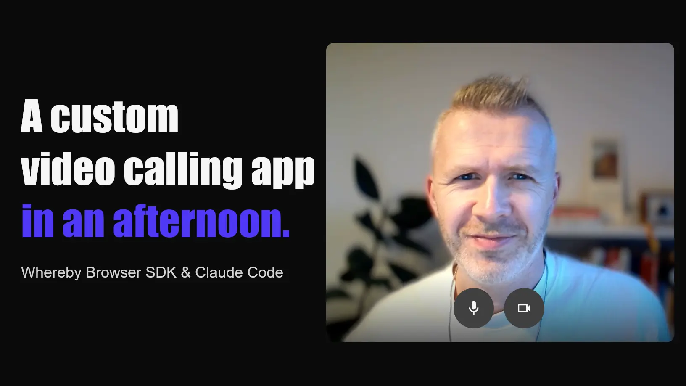
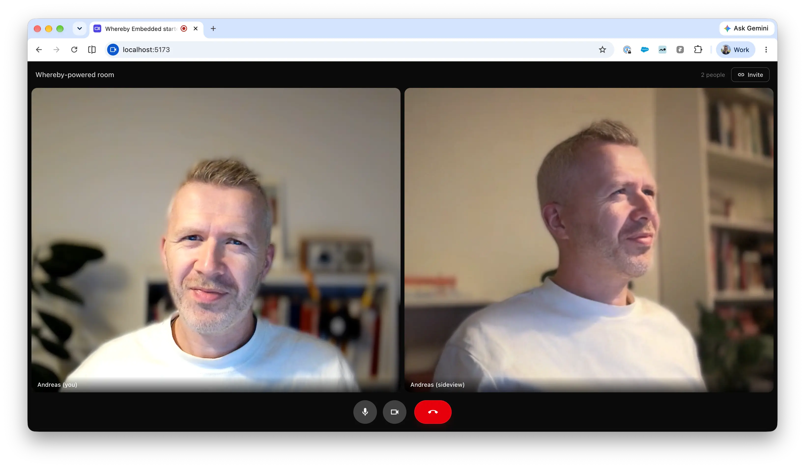

# Building a custom video calling app using Whereby Embedded, in an afternoon, with AI

[Whereby Embedded](http://whereby.com/information/embedded) lets you add video calls to any product or platform in no time: a simple web component gives you a white-label, prebuilt video calling UI with ample customisation options. Most of the time, that's exactly what you want.

But sometimes, you want to make it yours: a layout that is a perfect fit for your brand, custom call controls, a specific join flow. To achieve that, there's a second path: Whereby's Browser SDK allows you to add completely custom video calling functionality to your platform. The interface and frontend can be shaped in whatever way you want, and the SDK handles the hard parts of real-time video.

So, I set myself a challenge: how fast could I build a fully custom video calling app today, with Claude Code writing pretty much all of the code? About an afternoon, it turns out. I came away with a working app, plus a repo and a spec you can clone and bend to your own needs.

> **TL;DR:** I built a **custom video calling app** using the **Whereby Browser SDK**: room generation, a bespoke pre-join lobby, a knock-to-enter flow, an orientation-aware grid. It runs locally in five minutes, deploys to Netlify, and the whole thing started as a prompt. **Link to prompt** at the bottom.

## What’s happening under the hood

First off: what's actually going on when you build a custom calling interface with the Whereby Browser SDK's React hooks?

Simply said, the `@whereby.com/browser-sdk` React package hands you the call as building blocks: `useLocalMedia` for the camera and mic, `useRoomConnection` for the room and its feature set, and a `VideoView` component to render any participant's stream. The rest of the UI, you build yourself.

Throughout the exercise, I guided Claude Code to create the following:
* a dashboard that spins up Whereby rooms on demand
* a pre-join lobby with device pickers and a camera preview
* a knock-to-enter flow where the host admits guests
* a basic video calling experience with the essentials: mute, camera, and leave
* a video grid that re-lays itself out as the window resizes or a phone rotates

## Let’s dive in

If you're keen to check out what I built, [sign up](https://whereby.com/org/signup/embedded) for Whereby Embedded, create an API key in your dashboard, clone the [repo](https://github.com/whereby/building-with-whereby), drop your Whereby API key and Whereby subdomain in a `.env` file (see `.env.example` for a template), and start it:

```
git clone https://github.com/whereby/building-with-whereby
cd building-with-whereby
npm install
npm run dev
```
When you load the dashboard, you want to click on “Create room”, which will generate a new room link and give you a host link and a guest link you can use to join a call.



## Beyond localhost: deploy so you can test IRL

A video calling app that only runs on your laptop isn't much of a video app. The entire point of video calling is to connect with other people on other devices. So the next step is deploying this to a public URL.

The key thing to consider here is that your API key is a secret and has to stay server-side. Anyone who can read it can create rooms on your account, so it can never live in front-end code that ships to the browser. 

So, room creation goes through a tiny proxy: when running it locally, we use a local dev server; in production, we can use a small Netlify function, or you can use a similar offering from a different provider. Full details about the Netlify setup in the repository’s README file.

## Grab the prompt

As said, building this was AI-driven. I described what I wanted, and built it iteratively with Claude Code, tightening the spec as I went. That spec lives in the repo as `PROMPT.md` and you can totally use it for your own project. Want a different layout, a chat panel, a recording button or something else? Change the prompt and regenerate, or point an agent at the repo and ask.

That's the key takeaway here: building on a video calling SDK used to be a massive undertaking. Now, a lot can happen in an afternoon. **The cost of trying an idea has dropped a lot!**

## Have a play

The repo is on [GitHub](https://github.com/whereby/building-with-whereby). Clone it, fire up your favourite AI tool, and iterate away!

If there’s interest, this article can be the start of a series, where we’ll add more and more features as we go. Chat, transcriptions, screen sharing, and much more. Let me know what you think! 